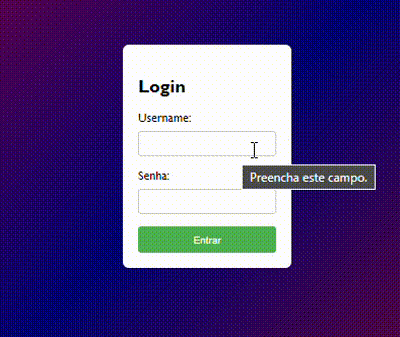

# Projeto formulário de login
    
Este é um projeto simples e eficiente de formulário de login para aplicativos da web. Ele oferece uma interface de usuário limpa e responsiva, além de funcionalidades de validação de entrada para garantir a segurança e integridade dos dados.

### Formulário de Login Intuitivo:
    Interface de usuário amigável para uma experiência de login fácil e rápida.

### Layout Responsivo: 
    Funciona bem em uma variedade de dispositivos, incluindo desktops, tablets e smartphones.

### Como Usar

    Faça o download ou clone o repositório para o seu ambiente local.

    git clone https://github.com/luan18alencar/form-Login.git

    Abra o arquivo index.html em seu navegador.

    Experimente o formulário de login e explore as funcionalidades.

## Ferramentas utilizadas
     GITHUB
     HTML5
     CSS3

## Informaçôes
    Crie html com base em outros projetos já feitos sem utilizar o bootstrap, criação pessoal com fontes

## fontes utilizadas

## imagem

# Autor
    Luan Abreu de Alencar